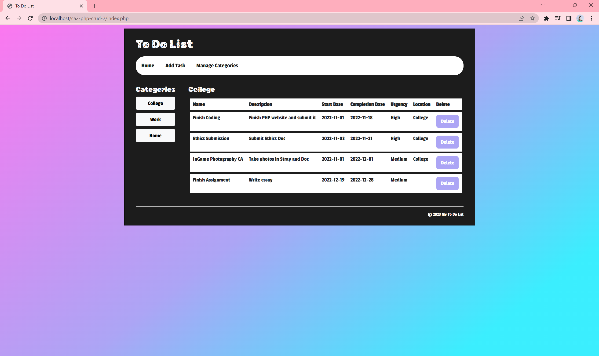
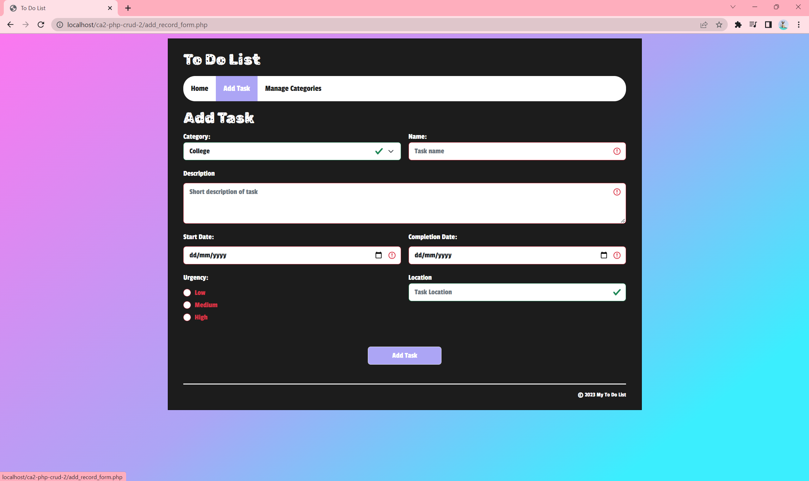
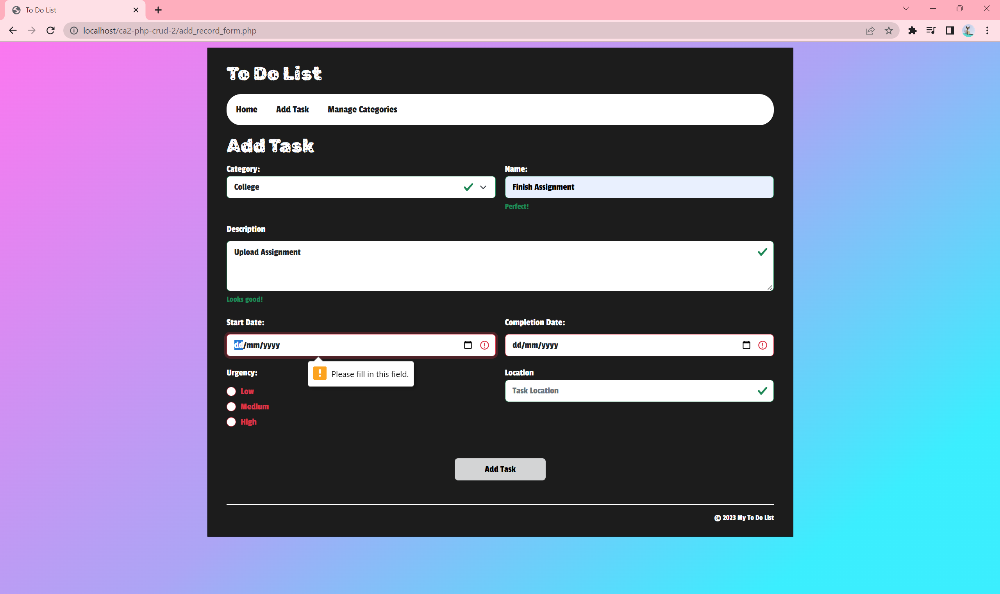
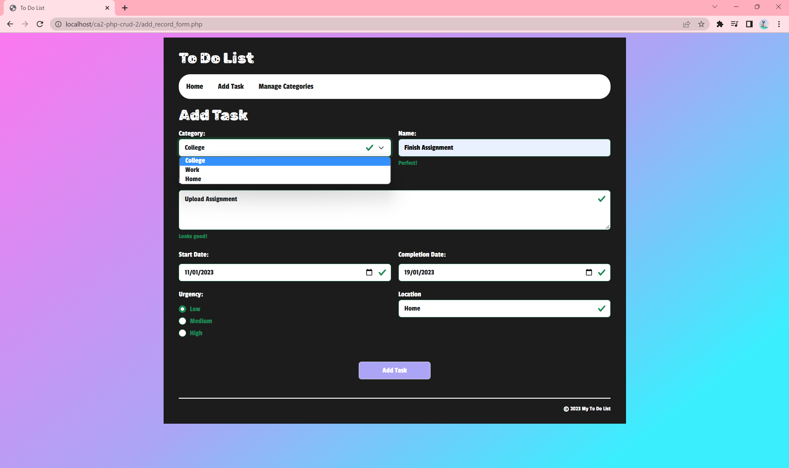
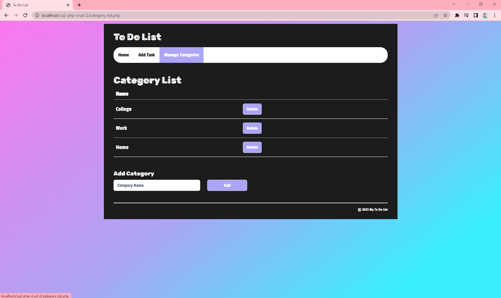
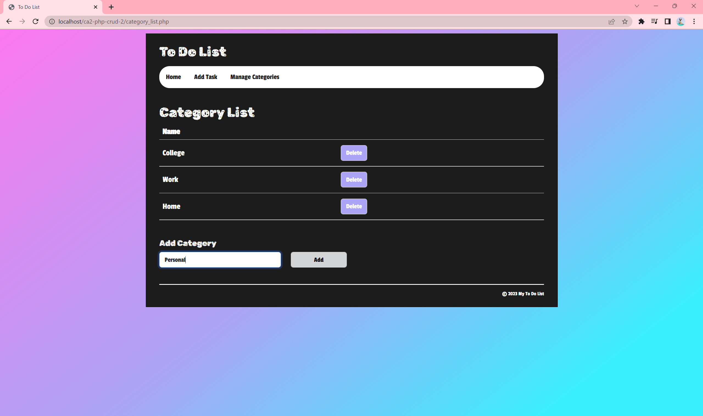
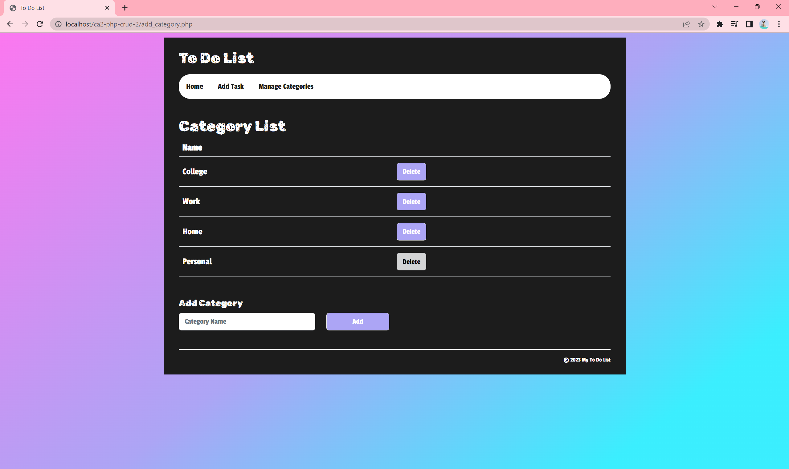
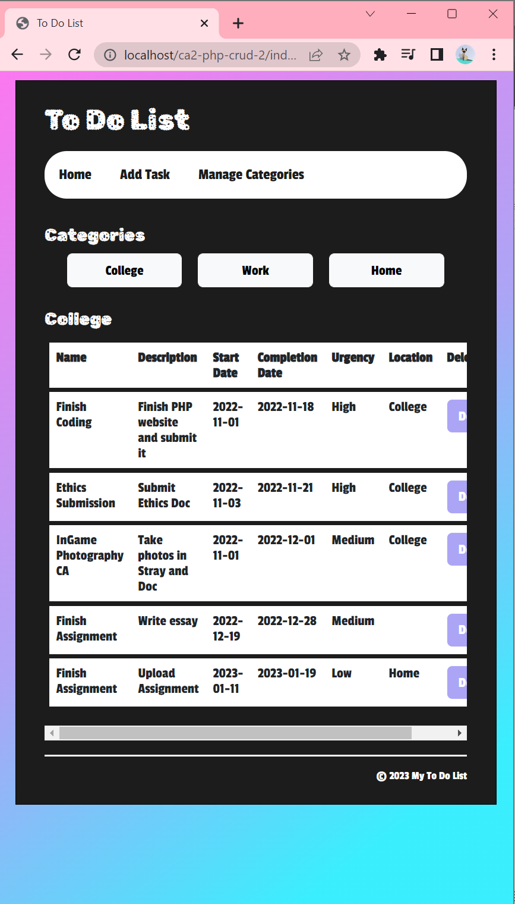
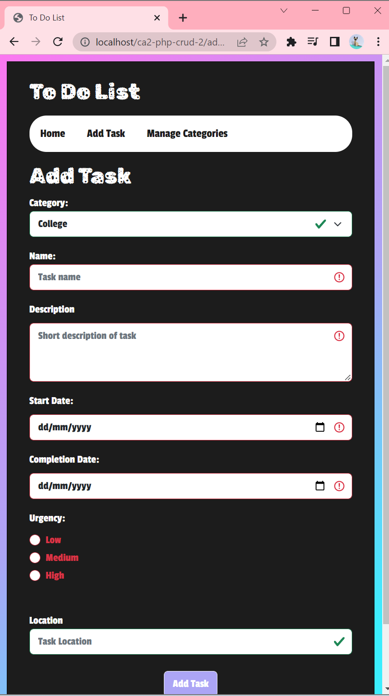
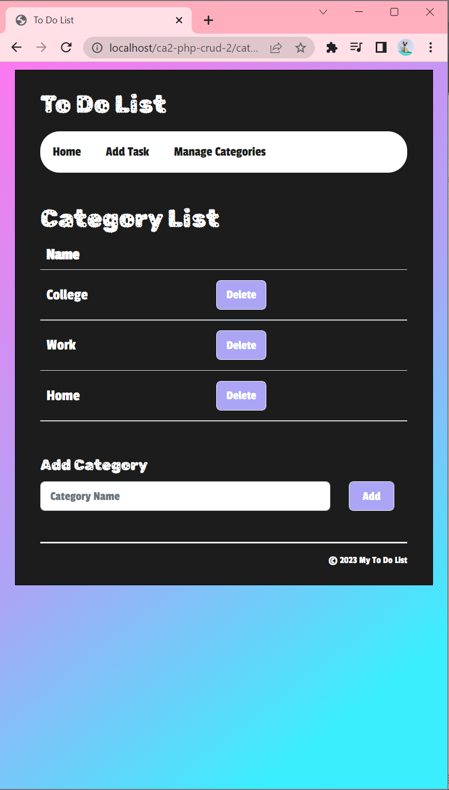

# students-php-crud
A starter project for DkIT students on the Server-Side module.
### Instructions
* Create a MySQL database called php-crud in PHP MyAdmin
* Run the code in the sql-db.txt file in PHP MyAdmin
* Move the PHP files in to your htdocs folder so Apache can process the PHP code
* Configure the database.php file to connect to your SQL database
### Merry Christmas
* Buy lots of presents
* Open presents!!

### To Do List Website

### Home Page
Home Page - College Category: 
The Home page displays all the tasks in the different categories

Click the buttons to view tasks in other categories

Home Page - Home Category: 

### Add Task Page
Add Task Page: 

To add a task - click on the Add Task Button in the Nav bar.
This brings you to the Add Task form

Fill in the form - all required inputs need to be filled.
If they are not a warning will pop up. Unfilled required inputs will be highlighted red and turn green once filled.

### Category Page

To view your categories click the Manage Categories button in the Nav bar.
Here you can add or delete catgories.

Fill in the input bar at the botton and press the "Add" button to add a category.

This will add the new category to the table

Just press the "Delete" button beside the category name to remove any unwanted categories. 

### Phone Size (as small as 576px)
The website is responsive to different screen sizes from desktop to phone.

